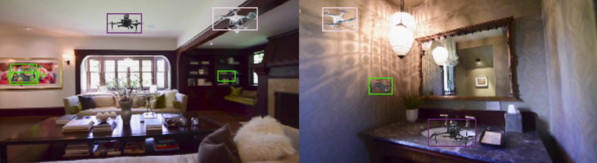

# Convert SSD Model from Caffe to Pytorch
This tool aims to load caffe prototxt and weights directly in pytorch without explicitly converting model from caffe to pytorch.
Adopted from [this](https://github.com/marvis/pytorch-caffe)

***
## Prerequisites:
- [ ] Pytorch >= 1.4
- [ ] Python  >= 3.5
We use Python3.7. To use other versions, change python version in script files such as run_demo.sh, run_train.sh
- [ ] **Important**: always run the following command when starting a new terminal.
```
bash scripts/set_env.sh 
```

***
## Train a model using the Caffe model's prototxt file  with Pytorch 
(using caffe dataloader style)
### Prepare data 
- [ ] All object should be indexed starting from 1. The number of classes used in the model's prototxt file should be equal to the number of types of objects + 1 (background)
- [ ] The ground truth's input to the network should be a tensor of size B x 6, where 
```
B = \sum_{images in batch} (number of objects in the image)
``` 
The second dimension of the tensor represents a box
```
[batch_index, class_index, x1, y1, x2, y2]
```
Where [x1,y1, x2,y2] are all normalized to [0,1].

### How to make the input image square 
SSD takes a square image as the input. Therefore, we need to make arbitrary images square. To do this, by default, we use center-cropping. However, there is an option to use center-cropping. Do it by chaning 
``` 
    --square_make_type crop 
```
with 
```
    --square_make_type pad
```
in run_train.sh, run_demo.sh

### Find the data statistics 
```
bash scripts/set_env.sh 
bash scripts/run_find_data_stats.sh
```
This will return two types of stats 
- [ ] Mean and Std of pixels in 3 channels RGB
- [ ] Clusters of bounding boxes in the (w, h) format, 
where w,h are normalized to image width and height
 
### Start training
```
bash scripts/set_env.sh 
bash run_train.sh
```
* Note: we use python3.7. 

***
## Test on images located in a folder
### Get the pretrained networks
Pretrained model can be downloaded from [this v2](https://drive.google.com/drive/folders/1mhgPOiSk2hM5oje28-Gv8672856xbtie?usp=sharing)

Download and save the pretrained_ckpt folder to the same repo with train.py

### Edit the run_demo.sh 
```
    # Path to the pretrained network 
    --pretrained_weights pretrained_ckpt/best_checkpoint.pth.tar \
    # Path to the test images
    --test_img_dir examples_images/three_drones/test_from_skydio_hd_ian_house \

```
### Run 
```
bash scripts/set_env.sh 
bash run_demo.sh
```
The results are visualized using Tensorboard. Go to the log file location, run tensorboard, open the link
that is shown up to display predicted boxes.

### Output Example

<p align="center">
  
</p>

***
## Customize the prior boxes 
## Prior boxes used in the Original VOC_SSD300 model 
Layer name                  | Feature size | perceptive field (step) | No of priorboxes/feature | Scale Aspects | min size | max size
---                         |---           | ---                     | ---                      |---            |---       |---  
conv4_3_norm_mbox_priorbox  |38x38  | 8  | 4 | 2,   | 030 | 060 | 
fc7_mbox_priorbox           |19x19  | 16 | 6 | 2,3  | 60  | 111
conv6_2_mbox_priorbox       |10x10  | 32 | 6 | 2,3  | 111 | 162
conv7_2_mbox_priorbox       |05x05  | 64 | 6 | 2,3  | 162 | 213 
conv8_2_mbox_priorbox       |03x03  | 100| 4 | 2,   | 213 | 264
conv9_2_mbox_priorbox       |01x01  | 300| 4 | 2,   | 264 | 315

## Our drone dataset
In our dataset, object sizes concenstrate around 1/15 * image's width. For 300x300 input images, object's sizes are around 20 pixels. 
The smallest is 1/18 ~ 16 pixels. One way to work around with these tiny objects is to do center crop the original images instead of zero padding.
Since the original image's aspect ratio is (16/9), such cropping will significantly increase the object sizes. Effectively, the median size will be 20 x 16/9 = 35, 
the min size is 16 x 16/9 = 28, the max size is 300 x 1/6 x 16/9 = 90. 
For now, we still use padding to make the input images square. Using kmean clustering, we found the following clusters
```
n_clusters:13
Accuracy: 86.60 %
Boxes (normalized):
 [[0.0604     0.02604375]
 [0.1469     0.09376875]
 [0.0792     0.04168125]
 [0.1302     0.07914375]
 [0.0823     0.05518125]
 [0.0979     0.0604125 ]
 [0.0542     0.01873125]
 [0.1198     0.05833125]
 [0.0823     0.031275  ]
 [0.0583     0.03645   ]
 [0.1083     0.0718875 ]
 [0.0667     0.047925  ]
 [0.099      0.04584375]]
Boxes (in pixels):
 [[18.12       7.813125 ]
 [44.07      28.130627 ]
 [23.76      12.5043745]
 [39.06      23.743124 ]
 [24.69      16.554375 ]
 [29.37      18.12375  ]
 [16.26       5.6193748]
 [35.94      17.499374 ]
 [24.69       9.3825   ]
 [17.49      10.934999 ]
 [32.49      21.56625  ]
 [20.009998  14.3775   ]
 [29.7       13.753125 ]]
Ratios:
 [1.3899999856948853, 1.4900000095367432, 1.5099999904632568, 1.5700000524520874, 1.600000023841858, 1.6200000047683716, 1.649999976158142, 1.899999976158142, 2.049999952316284, 2.1600000858306885, 2.319999933242798, 2.630000114440918, 2.890000104904175]
```

Using these clusters, we modify the prior boxes as follows, 
Layer name                  | Feature size | perceptive field (step) | No of priorboxes/feature | Scale Aspects | min size | max size
---                         |---           | ---                     | ---                      |---            |---       |---  
conv4_3_norm_mbox_priorbox  |38x38  | 8  | 6 | 1.5, 2, 2.5, 3 | 015 | 30 | 
fc7_mbox_priorbox           |19x19  | 16 | 5 | 1.5, 2, 2.5| 30 | 60
conv6_2_mbox_priorbox       |10x10  | 32 | 4 | 1.5, 2     | 60 | 120
conv7_2_mbox_priorbox       |05x05  | 64 | 3 | 1.5        | 120 | 200 
conv8_2_mbox_priorbox       |03x03  | 100| 3 | 1.5        | 200 | 250 
conv9_2_mbox_priorbox       |01x01  | 300| 0 | 

Turn off flip option => each feature will have
- [ ] + 1 ( 1:1 aspect ratio, by default)
- [ ] + 1 x number of aspect ratios 
- [ ] + 1 ( 1:1 aspect ratio with size = sqrt(min_size * max_size) 


We have to compute the number of output for the following layers
* 
conv4_3_norm_mbox_loc 
conv4_3_norm_mbox_conf 
Size of output of conv4_3_norm_mbox_priorbox is 34656 = 38x38x6x4
-> convolution_param { num_output: =
38x38x6x4/(38x38) = 24 

* 
fc7_mbox_loc
fc7_mbox_conf
Size of output of fc7_mbox_priorbox  is 7220 = 19x19x5x4
-> convolution_param { num_output: =
19x19x5x4/(19x19) = 20 

*
conv6_2_mbox_loc
conv6_2_mbox_conf 

Size of output of conv6_2_mbox_priorbox  is 1600 = 10x10x4x4
-> convolution_param { num_output: = 
10x10x4x4/(10x10) = 16 

* 
conv7_2_mbox_loc
conv7_2_mbox_conf
Size of output of conv7_2_mbox_priorbox is 400 = 5x5x4x4
-> convolution_param { num_output: = 
5x5x4x4/(5x5) = 16 

* 
conv8_2_mbox_loc
conv8_2_mbox_conf
Size of output of conv8_2_mbox_priorbox is 144 = 3x3x4x4
-> convolution_param { num_output: = 
3x3x4x4/(3x3) = 16 


***
## SSD300 Caffe model structure (n=21 classes)
### Todos
- [x] support forward classification networks: AlexNet, VGGNet, GoogleNet, [ResNet](http://pan.baidu.com/s/1kVm4ly3), [ResNeXt](https://pan.baidu.com/s/1pLhk0Zp#list/path=%2F), DenseNet
- [x] support forward detection networks: [SSD300](https://drive.google.com/open?id=0BzKzrI_SkD1_WVVTSmQxU0dVRzA), [S3FD](https://github.com/sfzhang15/SFD), FPN
- [x] Support custom layers from ASU team

### Supported Layers
Each layer in caffe will have a corresponding layer in pytorch. 
- [x] Convolution
- [x] InnerProduct
- [x] BatchNorm
- [x] Scale
- [x] ReLU
- [x] Pooling
- [x] Reshape
- [x] Softmax
- [x] Accuracy
- [x] SoftmaxWithLoss
- [x] Dropout
- [x] Eltwise
- [x] Normalize
- [x] Permute
- [x] Flatten
- [x] Slice
- [x] Concat
- [x] PriorBox
- [x] LRN : gpu version is ok, cpu version produce big difference
- [x] DetectionOutput: support batchsize=1, num_classes=1 forward
- [x] Crop
- [x] Deconvolution
- [x] MultiBoxLoss


 abc | def 
 --- | --- 

### SSD300 Model structure
 
Layer| Input Tensor | Output Tensor
---   |         ---    |        ---
forward conv1_2                       | [8, 64, 300, 300] -> |[8, 64, 300, 300]    
 forward relu1_2                       | [8, 64, 300, 300] -> |[8, 64, 300, 300]
forward pool1                         | [8, 64, 300, 300] -> |[8, 64, 150, 150]
forward conv2_1                       | [8, 64, 150, 150] -> |[8, 128, 150, 150]
forward relu2_1                       | [8, 128, 150, 150] ->| [8, 128, 150, 150]
forward conv2_2                       | [8, 128, 150, 150] ->| [8, 128, 150, 150]
forward relu2_2                       | [8, 128, 150, 150] ->| [8, 128, 150, 150]
forward pool2                         | [8, 128, 150, 150] ->| [8, 128, 75, 75]
forward conv3_1                       | [8, 128, 75, 75] -> |[8, 256, 75, 75]
forward relu3_1                       | [8, 256, 75, 75] -> |[8, 256, 75, 75]
forward conv3_2                       | [8, 256, 75, 75] -> |[8, 256, 75, 75]
forward relu3_2                       | [8, 256, 75, 75] -> |[8, 256, 75, 75]
forward conv3_3                       | [8, 256, 75, 75] -> |[8, 256, 75, 75]
forward relu3_3                       | [8, 256, 75, 75] -> |[8, 256, 75, 75]
forward pool3                         | [8, 256, 75, 75] -> |[8, 256, 38, 38]
forward conv4_1                       | [8, 256, 38, 38] -> |[8, 512, 38, 38]
forward relu4_1                       | [8, 512, 38, 38] -> |[8, 512, 38, 38]
forward conv4_2                       | [8, 512, 38, 38] -> |[8, 512, 38, 38]
forward relu4_2                       | [8, 512, 38, 38] -> |[8, 512, 38, 38]
forward conv4_3                       | [8, 512, 38, 38] -> |[8, 512, 38, 38]
forward relu4_3                       | [8, 512, 38, 38] -> |[8, 512, 38, 38]
forward pool4                         | [8, 512, 38, 38] -> |[8, 512, 19, 19]
forward conv5_2                       | [8, 512, 19, 19] -> |[8, 512, 19, 19]
forward relu5_2                       | [8, 512, 19, 19] -> |[8, 512, 19, 19]
forward conv5_3                       | [8, 512, 19, 19] -> |[8, 512, 19, 19]
forward relu5_3                       | [8, 512, 19, 19] -> |[8, 512, 19, 19]
forward pool5                         | [8, 512, 19, 19] -> |[8, 512, 19, 19]
forward fc6                           | [8, 512, 19, 19] -> |[8, 1024, 19, 19]
forward relu6                         | [8, 1024, 19, 19] ->| [8, 1024, 19, 19]
forward fc7                           | [8, 1024, 19, 19] ->| [8, 1024, 19, 19]
forward relu7                         | [8, 1024, 19, 19] ->| [8, 1024, 19, 19]
forward conv6_1                       | [8, 1024, 19, 19] ->| [8, 256, 19, 19]
forward conv8_1_relu                  | [8, 128, 5, 5] -> |[8, 128, 5, 5]
forward conv8_2                       | [8, 128, 5, 5] -> |[8, 256, 3, 3]
forward conv8_2_relu                  | [8, 256, 3, 3] -> |[8, 256, 3, 3]
forward conv9_1                       | [8, 256, 3, 3] -> |[8, 128, 3, 3]
forward conv9_1_relu                  | [8, 128, 3, 3] -> |[8, 128, 3, 3]
forward conv9_2                       | [8, 128, 3, 3] -> |[8, 256, 1, 1]
forward conv9_2_relu                  | [8, 256, 1, 1] -> |[8, 256, 1, 1]
forward conv4_3_norm                  | [8, 512, 38, 38] ->| [8, 512, 38, 38]
forward conv4_3_norm_mbox_loc         | [8, 512, 38, 38] ->| [8, 16, 38, 38]
forward conv4_3_norm_mbox_loc_perm    | [8, 16, 38, 38] -> | [8, 38, 38, 16]
forward conv4_3_norm_mbox_loc_flat    | [8, 38, 38, 16] -> | [8, 23104]
forward conv4_3_norm_mbox_conf        | [8, 512, 38, 38] ->| [8, 84, 38, 38]
forward conv4_3_norm_mbox_conf_perm   | [8, 84, 38, 38] -> | [8, 38, 38, 84]
forward conv4_3_norm_mbox_conf_flat   | [8, 38, 38, 84] -> | [8, 121296]
forward conv4_3_norm_mbox_priorbox    | [8, 512, 38, 38] ->| [1, 2, 23104]
forward fc7_mbox_loc                  | [8, 1024, 19, 19]->| [8, 24, 19, 19]
forward fc7_mbox_loc_perm             | [8, 24, 19, 19] -> | [8, 19, 19, 24]
forward fc7_mbox_loc_flat             | [8, 19, 19, 24] -> | [8, 8664]
forward fc7_mbox_conf                 | [8, 1024, 19, 19]->| [8, 126, 19, 19]
forward fc7_mbox_conf_perm            | [8, 126, 19, 19] ->| [8, 19, 19, 126]
forward fc7_mbox_conf_flat            | [8, 19, 19, 126] ->| [8, 45486]
forward fc7_mbox_priorbox             | [8, 1024, 19, 19]->| [1, 2, 8664]
forward conv6_2_mbox_loc              | [8, 512, 10, 10] -> |[8, 24, 10, 10]
forward conv6_2_mbox_loc_perm         | [8, 24, 10, 10] ->  |[8, 10, 10, 24]
forward conv6_2_mbox_loc_flat         | [8, 10, 10, 24] ->  |[8, 2400]
forward conv6_2_mbox_conf             | [8, 512, 10, 10] -> |[8, 126, 10, 10]
forward conv6_2_mbox_conf_perm        | [8, 126, 10, 10] -> |[8, 10, 10, 126]
forward conv6_2_mbox_conf_flat        | [8, 10, 10, 126] -> |[8, 12600]
forward conv6_2_mbox_priorbox         | [8, 512, 10, 10] -> |[1, 2, 2400]
forward conv7_2_mbox_loc              | [8, 256, 5, 5] ->   |[8, 24, 5, 5]
forward conv7_2_mbox_loc_perm         | [8, 24, 5, 5] ->    |[8, 5, 5, 24]
forward conv7_2_mbox_loc_flat         | [8, 5, 5, 24] ->    |[8, 600]
forward conv7_2_mbox_conf             | [8, 256, 5, 5] ->| [8, 126, 5, 5]
forward conv7_2_mbox_conf_perm        | [8, 126, 5, 5] ->| [8, 5, 5, 126]
forward conv7_2_mbox_conf_flat        | [8, 5, 5, 126] ->| [8, 3150]
forward conv7_2_mbox_priorbox         | [8, 256, 5, 5] ->| [1, 2, 600]
forward conv8_2_mbox_loc              | [8, 256, 3, 3] ->| [8, 16, 3, 3]
forward conv8_2_mbox_loc_perm         | [8, 16, 3, 3] -> | [8, 3, 3, 16]
forward conv8_2_mbox_loc_flat         | [8, 3, 3, 16] -> | [8, 144]
forward conv8_2_mbox_conf             | [8, 256, 3, 3] ->| [8, 84, 3, 3]
forward conv8_2_mbox_conf_perm        | [8, 84, 3, 3] -> | [8, 3, 3, 84]
forward conv8_2_mbox_conf_flat        | [8, 3, 3, 84] -> | [8, 756]
forward conv8_2_mbox_priorbox         | [8, 256, 3, 3] ->| [1, 2, 144]
forward conv9_2_mbox_loc              | [8, 256, 1, 1] ->| [8, 16, 1, 1]
forward conv9_2_mbox_loc_perm         | [8, 16, 1, 1] -> | [8, 1, 1, 16]
forward conv9_2_mbox_loc_flat         | [8, 1, 1, 16] -> | [8, 16]
forward conv9_2_mbox_conf             | [8, 256, 1, 1] ->| [8, 84, 1, 1]
forward conv9_2_mbox_conf_perm        | [8, 84, 1, 1] -> | [8, 1, 1, 84]
forward conv9_2_mbox_conf_flat        | [8, 1, 1, 84] -> | [8, 84]
forward conv9_2_mbox_priorbox         | [8, 256, 1, 1] ->| [1, 2, 16]
forward mbox_loc                      | [8, 23104] ->    | [8, 34928]
forward mbox_conf                     | [8, 121296] ->   | [8, 183372]
forward mbox_priorbox                 | [1, 2, 23104] -> | [1, 2, 34928]
 

#### mbox_conf is the concatenation of: 
                                                                   
Layer Name  | Input Tensor | Output Tensor
---     |     ---      |    ---
forward conv4_3_norm_mbox_conf       |  [8, 512, 38, 38] -> | [8, 84, 38, 38]	
forward conv4_3_norm_mbox_conf_perm  |  [8, 84, 38, 38] ->  | [8, 38, 38, 84]	
forward conv4_3_norm_mbox_conf_flat  |  [8, 38, 38, 84] ->  | [8, 121296]     
forward fc7_mbox_conf                |  [8, 1024, 19, 19] ->| [8, 126, 19, 19]	
forward fc7_mbox_conf_perm           |  [8, 126, 19, 19] -> | [8, 19, 19, 126]	
forward fc7_mbox_conf_flat           |  [8, 19, 19, 126] -> | [8, 45486]
forward conv6_2_mbox_conf            |  [8, 512, 10, 10] -> | [8, 126, 10, 10]	
forward conv6_2_mbox_conf_perm       |  [8, 126, 10, 10] -> | [8, 10, 10, 126]	
forward conv6_2_mbox_conf_flat       |  [8, 10, 10, 126] -> | [8, 12600]  
forward conv7_2_mbox_conf            |  [8, 256, 5, 5] ->   | [8, 126, 5, 5]	
forward conv7_2_mbox_conf_perm       |  [8, 126, 5, 5] ->   | [8, 5, 5, 126]	
forward conv7_2_mbox_conf_flat       |  [8, 5, 5, 126] ->   | [8, 3150]
forward conv8_2_mbox_conf            |  [8, 256, 3, 3] ->   | [8, 84, 3, 3]	
forward conv8_2_mbox_conf_perm       |  [8, 84, 3, 3] ->    | [8, 3, 3, 84]	
forward conv8_2_mbox_conf_flat       |  [8, 3, 3, 84] ->    | [8, 756]
forward conv9_2_mbox_conf            |  [8, 256, 1, 1] ->   | [8, 84, 1, 1]	
forward conv9_2_mbox_conf_perm       |  [8, 84, 1, 1] ->    | [8, 1, 1, 84]	
forward conv9_2_mbox_conf_flat       |  [8, 1, 1, 84] ->    | [8, 84]

Concatenation: 121296 + 45486 + 12600 + 3150 + 756 + 84 = 183372 
All of these have taken into account 21 classes. 
In order to work with three_drones dataset which has only 3 classes, we have to change the number of output channels of every element in this concatenation by 7


#### mbox_loc is the concatenation of: 
Layer Name  | Input Tensor | Output Tensor
---     |     ---      |    ---
forward conv4_3_norm_mbox_loc        |  [8, 512, 38, 38] ->| [8, 16, 38, 38]
forward conv4_3_norm_mbox_loc_perm   |  [8, 16, 38, 38] -> | [8, 38, 38, 16]
forward conv4_3_norm_mbox_loc_flat   |  [8, 38, 38, 16] -> | [8, 23104]
forward fc7_mbox_loc                 |  [8, 1024, 19, 19]->| [8, 24, 19, 19]
forward fc7_mbox_loc_perm            |  [8, 24, 19, 19] -> | [8, 19, 19, 24]
forward fc7_mbox_loc_flat            |  [8, 19, 19, 24] -> | [8, 8664]
forward conv6_2_mbox_loc             |  [8, 512, 10, 10] ->| [8, 24, 10, 10]
forward conv6_2_mbox_loc_perm        |  [8, 24, 10, 10] -> | [8, 10, 10, 24]
forward conv6_2_mbox_loc_flat        |  [8, 10, 10, 24] -> | [8, 2400]
forward conv7_2_mbox_loc             |  [8, 256, 5, 5] ->  | [8, 24, 5, 5]
forward conv7_2_mbox_loc_perm        |  [8, 24, 5, 5] ->   | [8, 5, 5, 24]
forward conv7_2_mbox_loc_flat        |  [8, 5, 5, 24] ->   | [8, 600]
forward conv8_2_mbox_loc             |  [8, 256, 3, 3] ->  |  [8, 16, 3, 3]
forward conv8_2_mbox_loc_perm        |  [8, 16, 3, 3] ->   | [8, 3, 3, 16]
forward conv8_2_mbox_loc_flat        |  [8, 3, 3, 16] ->   | [8, 144]
forward conv9_2_mbox_loc             |  [8, 256, 1, 1] ->  |  [8, 16, 1, 1]	
forward conv9_2_mbox_loc_perm        |  [8, 16, 1, 1] ->   | [8, 1, 1, 16]	
forward conv9_2_mbox_loc_flat        |  [8, 1, 1, 16] ->   | [8, 16]

23104 + 8664 + 2400 + 600 + 144 + 16 = 34928

However, we do not need to do anything since the size of mbox_loc = 8732 (per/class) x 4, is fixed regardless of the number of classes

#### mbox_priorbox is the concatenation of 
Layer Name  | Input Tensor | Output Tensor
---     |     ---      |    ---
forward conv4_3_norm_mbox_priorbox   |  [8, 512, 38, 38] ->  |[1, 2, 23104]
forward fc7_mbox_priorbox            |  [8, 1024, 19, 19] -> |[1, 2, 8664]
forward conv6_2_mbox_priorbox        |  [8, 512, 10, 10] ->  | [1, 2, 2400]
forward conv7_2_mbox_priorbox        |  [8, 256, 5, 5] ->    | [1, 2, 600]
forward conv8_2_mbox_priorbox        |  [8, 256, 3, 3] ->    | [1, 2, 144]
forward conv9_2_mbox_priorbox        |  [8, 256, 1, 1] ->    | [1, 2, 16]

23104 + 8664 + 2400 + 600 + 144 + 16 = 34828
However, we do not need to do anything since the size of mbox_loc = 8732 (per/class) x 4, is fixed regardless of the number of classes

***
## Parse prototxt to create a pytorch model only
### Requirements:
- Pytorch 

### Convert a Caffe model to a Pytorch model
given the Caffe model's prototxt file 
```
python3.7 demo_converted_pytorch_model.py --prototxt <path_to_caffe_prototxt_file> 
```
***
### Parse prototxt to create a pytorch model and load the pretrained caffe model
#### Requirements:
- Pytorch 
- Caffe 
 
```
from caffenet import *

def load_image(imgfile):
    import caffe
    image = caffe.io.load_image(imgfile)
    transformer = caffe.io.Transformer({'data': (1, 3, args.height, args.width)})
    transformer.set_transpose('data', (2, 0, 1))
    transformer.set_mean('data', np.array([args.meanB, args.meanG, args.meanR]))
    transformer.set_raw_scale('data', args.scale)
    transformer.set_channel_swap('data', (2, 1, 0))

    image = transformer.preprocess('data', image)
    image = image.reshape(1, 3, args.height, args.width)
    return image

def forward_pytorch(protofile, weightfile, image):
    net = CaffeNet(protofile)
    print(net)
    net.load_weights(weightfile)
    net.eval()
    image = torch.from_numpy(image)
    image = Variable(image)
    blobs = net(image)
    return blobs, net.models

imgfile = 'data/cat.jpg'
protofile = 'resnet50/deploy.prototxt'
weightfile = 'resnet50/resnet50.caffemodel'
image = load_image(imgfile)
pytorch_blobs, pytorch_models = forward_pytorch(protofile, weightfile, image)

```
